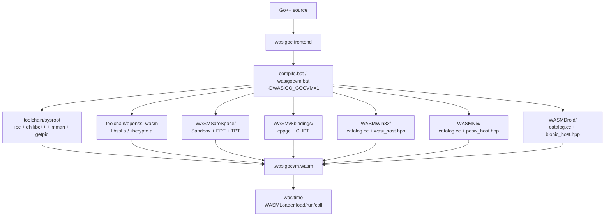

# wasigocvm architecture

wasm32 gives a process **one linear memory**. wasigocvm's second address
space is not a second memory, not `wasm --shared-memory`, not
wasi-threads, and not a hop to a native companion. It is three
tag-checked pointer tables, loaded as-is from existing artifacts:

| Table | Artifact | Maps | Used for |
| --- | --- | --- | --- |
| **EPT** | `WASMSafeSpace/` `ExternalPointerTable` | sandboxed handle → raw outside resource | exec stdout, Win32/Nix/Droid catalogs |
| **TPT** | `WASMSafeSpace/` `TrustedPointerTable` | sandboxed handle → trusted outside object | ExecProc parent, Win32/Nix/Droid process/thread |
| **CHPT** | `WASMv8bindings/` `CppHeapPointerTable` | handle → cppgc object in the cage | ExecChild, Win32Kernel, NixKernel, DroidKernel |

The cage (`WASMSafeSpace/` `Sandbox`) still exists so CHPT payloads
live on NormalPages inside `Sandbox::current()`. Table *storage* is
outside the cage. Isolation is the handle, not a second `Memory`.

This is a **monolith VM in wasm**. The sysroot, libc, libc++, Oilpan,
gocvm (sockets / exec / OpenSSL TLS), the cage, the tables, WASMWin32 /
WASMNix / WASMDroid names, and `wasitime` itself (`wasitime.wasm`) are one module. Product
gate: `-DWASIGO_GOCVM=1`. Stock `__wasip2__` / WIT is not the ABI.

Bytecode (WASM 2 hard fork, Oilpan instead of WASM GC): [wasm2-fork.md](wasm2-fork.md).
Host ABI (Win32 / Nix / Droid catalogs on EPT/TPT/CHPT): [host-abi.md](host-abi.md).
How to build and run: [wasigocvm.md](wasigocvm.md).

## What this is not

- Not Bytecode Alliance Wasmtime + a WASI guest. The module is the
  machine. `wasitime` loads and calls through in-tree `WASMLoader/`
  (Go++ port: `examples/wasmloaderpkg`).
- Not the Component Model. Becoming a `wasi:cli` / `wasi:sockets` WIT
  world is the fork we left.
- Not `gocvm_host` / `--host-bridge`. Libc-covered ABI stays in the
  module.
- Not `kernel32` PE imports compiled into wasm (`WASMWin32/`
  `host_win.cc` is native-only). `CreateProcessW` is a catalog name:
  native calls kernel32; wasm spawns a `std::thread` and runs
  `wasi_call` / `WslExec`. `LoadLibraryW` is the same hop: named
  modules this machine has, plus files it can map. A PE image is mapped
  by `WASMPELoader/` (headers, sections, relocs, IAT via catalog resolve).
  x86 bytes stay data in the mapper. MainDLL (`DllMain` / TLS) runs on the
  LoadLibrary hop through `WHvRunVirtualProcessor`. WASMWin32 `pe_map.hpp` includes
  that hop.
- Not a BusyBox copy of `echo`/`true`/`uname` inside `exec.hpp`. Child
  work is `WASMWin32/` `wasi_call`.
- Not a rewrite of WASMSafeSpace, WASMv8bindings, WASMWin32,
  WASMNix, WASMDroid, WASMLoader, WASMPELoader, or WASMLime. Those are
  loaded and called.

## One module

```
                    wasm32 linear memory (the only Memory)
  ┌─────────────────────────────────────────────────────────────┐
  │  Go++ runtime   Oilpan / cooperative goroutines             │
  │  libc / libc++  sockets, mmap, getpid, uname, stat          │
  │  gocvm          net poll · exec · OpenSSL TLS               │
  │  WASMWin32      wasi_host.hpp + catalog.cc                  │
  │  WASMNix        posix_host.hpp + catalog.cc                 │
  │  WASMDroid      bionic_host.hpp + catalog.cc                │
  │  cage pages     cppgc ExecChild, Win32/Nix/Droid (CHPT)     │
  └─────────────────────────────────────────────────────────────┘
           ▲ handles                              ▲ handles
           │                                      │
     EPT / TPT (table storage outside cage)     CHPT
     WASMSafeSpace                              WASMv8bindings
```



A clang binary may still be named `wasm32-wasip2-clang++`. That is a
compiler *filename*. The identity is `WASIGO_GOCVM`, stamped in
`toolchain/wasigocvm-toolchain.json`.

## Second address space: EPT / TPT / CHPT

`src/wasigocvm_aspace.hpp` boots one `Aspace { ept, tpt, chpt }`, one
8 MiB `Sandbox`, and one process-lifetime `cppgc::Heap`
(`Create().release()` — wasm `atexit` must not run `~Heap`; Finalize
traps on the indirect function table).

Tags:

| Tag | Table | Payload |
| --- | --- | --- |
| `kExecChildTag` | CHPT | cppgc `ExecChild` in the cage |
| `kWin32KernelTag` | CHPT | cppgc `Win32Kernel` in the cage |
| `kWin32TokenTag` | CHPT | cppgc `Win32Sec{"token"}` session token |
| `kWin32SidTag` | CHPT | cppgc `Win32Sec{"sid"}` well-known SID |
| `kWin32PebTag` | CHPT | cppgc `Win32Sec{"peb"}` process environment |
| `kWin32TebTag` | CHPT | cppgc `Win32Sec{"teb"}` thread environment |
| `kWin32WndTag` | CHPT | cppgc `Win32Sec{"wnd"}` HWND table |
| `kWin32GdiTag` | CHPT | cppgc `Win32Sec{"gdi"}` DC/brush/pen/font |
| `kWin32ComTag` | CHPT | cppgc `Win32Sec{"com"}` COM apartment objects |
| `kNixSessionTag` | CHPT | cppgc `NixKernel` / `NixSession` |
| `kDroidSessionTag` | CHPT | cppgc `DroidKernel` / `DroidSession` |
| `kGocOSSessionTag` | CHPT | cppgc `GocOSKernel` / `GocOSSession` |
| `kExecStdoutTag` | EPT | `new[]` stdout buffer (outside resource) |
| `kWin32CatalogTag` | EPT | `wasmwin32_catalog()` name table |
| `kWin32VmemTag` | EPT | linear-memory VirtualAllocEx / section view root |
| `kWin32SockTag` | EPT | in-memory WSA duplex root (`net.Pipe` shape) |
| `kWin32CngTag` | EPT | bcrypt algorithm/hash/key root |
| `kWin32ModTag` | EPT | LoadLibrary module table |
| `kWin32CertTag` | EPT | crypt32 certificate store root |
| `kWin32HttpTag` | EPT | WinHttp session/connect/request root |
| `kWin32WhpTag` | EPT | WinHvPlatform partition / VP root |
| `kWin32HeapTag` | EPT | HeapAlloc / RtlAllocateHeap root |
| `kNixCatalogTag` | EPT | `wasmnix_catalog()` name table |
| `kDroidCatalogTag` | EPT | `wasmdroid_catalog()` name table |
| `kDroidBinderTag` | EPT | Binder / ashmem / ion root |
| `kGocOSCatalogTag` | EPT | `wasmgocos_catalog()` name table |
| `kGocOSDesktopTag` | EPT | DesktopEngine HWND / GPU present root |
| `kGenericTrustedObjectTag` | TPT | `ExecProc*`, Win32/Nix/Droid process/thread tokens |

A raw cppgc pointer is not an address in this model. Persistent is a GC
root, not a name. Parent and child name each other **only** through
handles:

```
parent ExecProc                         child ExecChild (cage, CHPT)
  chpt ──CHPT──► ExecChild                parent_h ──TPT──► ExecProc
                                          out_h    ──EPT──► stdout bytes
```

`exec_child_of` / `exec_parent_of` / `exec_stdout_of` are `table.Get`
with the matching tag. A handle that does not check out is not that
object.

wasm32 still has one `Memory`. Fork does not invent a second instance.
The child is a table-named process in this module.

## WASMWin32 on the tables

`WASMWin32/` in this repo is not rewritten. Two pieces, two roles:

| File | Role in wasm |
| --- | --- |
| `include/win32/wasi_host.hpp` | libc backend: win32metadata names mapped to POSIX the sysroot actually ships |
| `src/catalog.cc` | name table (`GetCurrentProcessId`, `WslExec`, …) |
| `src/host_win.cc` | not the ABI |

The Win32 session is pointed at the same tables exec uses:

```
Win32Kernel (cage, CHPT)
  process_h  ──TPT──► Win32Token{"process"}
  thread_h   ──TPT──► Win32Token{"thread"}
  token_h    ──CHPT──► Win32Sec{"token"}
  sid_h      ──CHPT──► Win32Sec{"sid"}
  peb_h      ──CHPT──► Win32Sec{"peb"}
  teb_h      ──CHPT──► Win32Sec{"teb"}
  wnd_h      ──CHPT──► Win32Sec{"wnd"}
  gdi_h      ──CHPT──► Win32Sec{"gdi"}
  com_h      ──CHPT──► Win32Sec{"com"}
  catalog_h  ──EPT──► WasmWin32Api[] from catalog.cc
  vmem_h     ──EPT──► VirtualAllocEx / NtCreateSection view root
  sock_h     ──EPT──► WSA in-memory duplex root
  cng_h      ──EPT──► bcrypt algorithm/hash/key root
  mod_h      ──EPT──► LoadLibrary module table
  cert_h     ──EPT──► crypt32 store/context root
  http_h     ──EPT──► WinHttp session table
  whp_h      ──EPT──► WinHvPlatform partition / VP root
```

`gocvm.Call("win32", …)` requires `win32_tables_ok()` before
`wasmwin32::wasi_call`. No catalog handle, no call.

Token/SID APIs (`OpenProcessToken`, `GetTokenInformation`,
`LookupAccountSidW`, …) allocate synthetic handles in `wasi_k32.hpp`
and name the session objects on CHPT. `VirtualAllocEx` /
`ReadProcessMemory` / `WriteProcessMemory` stay in this module's
linear memory (current process / table-named child). `DeviceIoControl`
is an in-memory dispatch table in `wasi_host.hpp` (`wasi_device_ioctl`).
`WSASocketW` / `bind` / `listen` / `connect` / `WSASend` / `WSARecv`
are duplex channels in the module (`inproc:` names), not a host
socket trap. `NtQueryInformationProcess` / `NtCreateSection` /
`NtMapViewOfSection` are the same hop as `CreateFileMappingW` /
`VirtualAllocEx` (wasm: section table + linear memory; native:
`GetProcAddress(ntdll)`). `NtAllocateVirtualMemory` / `NtCreateFile` /
`NtWaitForSingleObject` and the rest of the catalog Nt* names are the
same hop (wasm: existing k32 tables + libc; native: ntdll or the
kernel32 stand-in those syscalls wrap). PEB/TEB blobs are RPM-readable at the
public x86 offsets (`BeingDebugged` @ 2, `Ldr` @ 0x0C,
`ProcessParameters` @ 0x10). VEH is an in-module handler list;
`RaiseException` walks it and continues. `BCryptGenRandom` /
`BCryptCreateHash` are bcrypt.dll on native and SHA-256/entropy in
the module on wasm (not a rewrite of OpenSSL). `NCryptOpenStorageProvider`
/ `NCryptGenRandom` are ncrypt.dll on native and the same CNG table
on wasm. `LoadLibraryW` /
`GetProcAddress` / `LdrLoadDll` name modules on EPT (`kWin32ModTag`): catalog DLLs
this hop implements, `.wasm` files this module can map, and PE images
through `~/WASMPELoader` (resources, delay-load IAT, TLS callback RVAs).
MainDLL (`DllMain` / AddressOfEntryPoint) and TLS run on that hop through
`WHvRunVirtualProcessor` (native: `WinHvPlatform.dll` / real `LoadLibrary`
entry; wasm: table-named VP, no PE-to-wasm JIT). Guest setup is
`WHvSetPartitionProperty` (ProcessorCount before Setup), `WHvMapGpaRange`
(host pages ↔ GPA image), `WHvSetVirtualProcessorRegisters` packing CS as
`WHV_X64_SEGMENT_REGISTER` and GDTR as `WHV_X64_TABLE_REGISTER`, and a
`WHvRunVirtualProcessor` exit decode (`reason`, `rip`, IO/MMIO/exception).
`WHvEmulatorTryIoEmulation` / `TryMmioEmulation` (`WinHvEmulation.dll`) handle
those IO/MMIO exits.
`FindResourceW` reads that resource directory. `CryptProtectData` /
`CertOpenStore` are crypt32 on native and the EPT cert root on wasm.
`SHGetFolderPathW` / `PathFileExistsW` are shell32/shlwapi. `WinHttpOpen` /
`WinHttpCrackUrl` are winhttp.dll on native and an EPT session table on
wasm (not a rewrite of OpenSSL/`net/http`). `GetAdaptersAddresses` is
iphlpapi on native and loopback on wasm. `GetFileVersionInfoW` is
version.dll / the mapped PE version resource. `InitCommonControlsEx` /
`ImageList_*` are comctl32. `InternetOpenW` / `InternetGetConnectedState`
are wininet.dll (same session table as WinHttp on wasm). `GetUserNameExW`
is secur32, `DnsNameCompare_A` is dnsapi, `SymInitialize` / `ImageNtHeader`
are dbghelp, `IsThemeActive` / `DwmIsCompositionEnabled` are uxtheme/dwmapi,
`UuidCreate` is rpcrt4. `WinVerifyTrust` is wintrust.dll on native; wasm
does not invent Authenticode. ntdll `RtlGetVersion` / `RtlAllocateHeap` /
`RtlEqualUnicodeString` / `NtCreateSemaphore` / `NtQueryTimerResolution`
are ntdll.dll on native and the same kernel tables on wasm. ntdll is cataloged
to kernel32 breadth: Zw* for every Nt*, plus Rtl heap/CS/SRW/path/SID, Ldr*,
and Tp* threadpool. `DbgBreakPoint` / `NtShutdownSystem` / `NtRaiseHardError`
are cataloged but not executed. `SetupDiGetClassDevsW` / `CM_Locate_DevNodeW`
are setupapi/cfgmgr32 (one present device on wasm). `NetGetJoinInformation`
is netapi32. `PdhOpenQueryW` is pdh. `EvtQuery` is wevtapi. Extra
`PathIsRelativeW` / `PathCanonicalizeW` are shlwapi. `GetFileTitleW` is
comdlg32 with no dialog. `HWND` /
GDI objects / COM apartment sit on CHPT. Native leftovers still call
user32 / gdi32 / ole32 / advapi32 / kernel32 / ntdll / ws2_32 / bcrypt / ncrypt / crypt32 / shell32 / winhttp / iphlpapi / version / comctl32 / wininet / dnsapi / secur32 / dbghelp / wintrust / uxtheme / dwmapi / rpcrt4 / setupapi / cfgmgr32 / netapi32 / pdh / wevtapi / comdlg32.

WslList / WslExec (`uname`, `pwd`, `hostname`, `true`, `:`, `echo`,
`id`) on the Win32 topic stay Win32 catalog names. The `wsl` and `nix`
topics hop to `~/WASMNix` `posix_call`. Host PE files map through
`~/WASMPELoader`. `CreateProcessW` is not a missing fork: it is a
`std::thread` child on TPT, same work as `os/exec.start`.

## WASMNix on the tables

`WASMNix/` in this repo is not rewritten. Two pieces, two roles:

| File | Role in wasm |
| --- | --- |
| `include/nix/posix_host.hpp` | libc backend: Linux man-pages / POSIX / WSL / Nix names mapped to POSIX the sysroot actually ships |
| `src/catalog.cc` | name table (`getpid`, `WslList`, `NixVersion`, …) |
| `src/host_linux.cc` / `host_wsl.cc` | native libc / `wsl.exe` — **not** linked into the wasm module |

```
NixKernel (cage, CHPT)
  process_h  ──TPT──► NixToken{"process"}
  thread_h   ──TPT──► NixToken{"thread"}
  session_h  ──CHPT──► NixSession{"session"}
  catalog_h  ──EPT──► WasmNixApi[] from catalog.cc
```

`gocvm.Call("linux"|"wsl"|"nix", …)` requires `nix_tables_ok()` before
`wasmnix::posix_call`. No catalog handle, no call.

## WASMDroid on the tables

`WASMDroid/` in this repo is not rewritten. Two pieces, two roles:

| File | Role in wasm |
| --- | --- |
| `include/droid/bionic_host.hpp` | Bionic-shaped libc backend (Binder / KVM stay in-module) |
| `src/catalog.cc` | name table (`getpid`, `BINDER_WRITE_READ`, `KVM_RUN`, …) |
| `src/host_linux.cc` / `host_win.cc` | native hop — **not** linked into the wasm module |

```
DroidKernel (cage, CHPT)
  process_h  ──TPT──► DroidToken{"process"}
  thread_h   ──TPT──► DroidToken{"thread"}
  session_h  ──CHPT──► DroidSession{"session"}
  catalog_h  ──EPT──► WasmDroidApi[] from catalog.cc
  binder_h   ──EPT──► Binder / ashmem / ion root
```

`gocvm.Call("android"|"binder"|"kvm", …)` requires `droid_tables_ok()`
before `wasmdroid::bionic_call`. No catalog handle, no call.

## Exec is not simulated

`os/exec` (`src/wasigocvm_exec.hpp`):

1. Bind a cppgc `ExecChild` in the cage; name it on CHPT; name the
   parent on TPT.
2. Require the Win32 session on those tables.
3. Run argv through `wasmwin32::wasi_call`: catalog API if the basename
   is in the EPT catalog, otherwise `WslExec`.
4. Commit stdout onto EPT (`kExecStdoutTag`). Wait/read go through
   those handles.

A `.wasm` payload is load/call via **wasitime / WASMLoader**, not a
second command table and not `cmd.exe`. Do not invent a BusyBox so
tests pass.

`examples/forkexec` (`echo` / `true` / `false` / `uname`) is this path.

One linear memory: isolation is the tables. The child occupies a
`std::thread` (`CreateProcessW` is that hop).

## TLS, net, libc — in the module

| Concern | In-module path | Not |
| --- | --- | --- |
| Sockets | sysroot libc + `wasigocvm_net.hpp` `poll()` workers on the cooperative scheduler | WIT `wasi:sockets`, companion host |
| TLS | OpenSSL 3.6.3 wasm (`toolchain/openssl-wasm` `libssl.a`) with memory BIOs, same shape as `WASMLime/` `TlsTransport` (`SSL_do_handshake`, SNI) | Schannel, native vcpkg mingw DLLs, `gocvm_host` |
| mmap / getpid | mmap is cage linear memory (`-D_WASI_EMULATED_MMAN`); getpid is the occupancy table (not libwasi-emulated-getpid) | host pid, host `VirtualAlloc` |
| syscall / os.user / kill | `wasigocvm_libc.hpp` | host hop |
| `.wasm` load/run/call | in-tree `WASMLoader/` (Go++ port `examples/wasmloaderpkg`) on the Go++ wazero interpreter (`examples/wazgoc`) + WASMSafeSpace + WASMv8Bindings CHPT | rewriting the guest as host applets; vendoring tetratelabs/wazero; w2g |

CA store: `SSL_CERT_FILE` / `SSL_CERT_DIR`. WASMNetStack is an SCTP/WSS
overlay, not TLS 1.3 over TCP; it is not this handshake.

## Load and call

Named artifacts stay themselves. The machine wires them.

| Artifact | What we take | What we do not do |
| --- | --- | --- |
| `WASMSafeSpace/` | `sandbox.cc`, EPT, TPT | rewrite the cage |
| `WASMv8bindings/` | cppgc heap + CHPT | invent a second GC |
| `WASMWin32/` | `wasi_host.hpp`, `catalog.cc` | `host_win.cc` as a second ABI |
| `WASMNix/` | `posix_host.hpp`, `catalog.cc` | `host_linux.cc` as a second ABI |
| `WASMDroid/` | `bionic_host.hpp`, `catalog.cc` | `host_linux.cc` / `host_win.cc` as a second ABI |
| `WASMGocOS/` | `host.hpp`, `gockrnl.hpp`, `gocsys.hpp`, `catalog.cc` | `host_win.cc` as a second ABI; malloc in GocKrnl |
| `WASMPELoader/` | `include/wasmpe/loader.hpp` | PE-to-wasm JIT |
| `WASMLoader/` | load/call as-is (wasmbin + loader packages) on the Go++ wazero interpreter | os/exec stand-in for the guest; shoving original wazero sources |
| `WASMJsLoader/` | browser instantiate / run / call; GocOS cmd is `cmd.html` + xterm.js | rewrite WASMWin32; wazero in the page; host bridge |
| `WASMLime/` | TlsTransport shape (memory BIO OpenSSL) | reimplement TLS 1.3 |

`cppgc` headers are parsed at **file scope** in `runtime.hpp` (via
`wasigocvm_aspace.hpp`). Including them from inside `namespace wasigo`
makes `std` become `wasigo::std` and the build dies in type_traits.

## Versus Bytecode Alliance

| | Bytecode Alliance | wasigocvm |
| --- | --- | --- |
| Engine | Host Wasmtime (Cranelift) | The module **is** the machine; `wasitime.wasm` is the runtime |
| ABI | WASI p1 `fd_write` / p2 WIT worlds | libc in the module; `WASIGO_GOCVM` |
| Isolation | Instance + host capabilities | EPT/TPT/CHPT handles in one Memory |
| Sockets | Preview 2 WIT, or host | sysroot sockets + in-module poll |
| Processes | Not in WASI | Table-named child + WASMWin32 |
| TLS | Host or guest WASI crypto proposals | OpenSSL wasm, memory BIOs |
| Language | You bring one | Go++ → C++ → this sysroot |

`docs/wasip2.md` is retired as a product story. `legacy.bat` remains
for **stock wasip1 noeh** goldens only.

## Native leftover

`~/gocvm_sandbox` (formerly shim_sandbox) is the same cage story when
the output is a host `.exe` (`goclang++`): WASMSafeSpace in-process, not
a companion. It is not a hop *from* wasm back to native for ABI the
module already has.

## Source map

| Piece | File |
| --- | --- |
| Product define | `src/wasigocvm_config.hpp` |
| Oilpan / goroutines | `src/runtime.hpp` |
| EPT/TPT/CHPT boot | `src/wasigocvm_aspace.hpp` |
| libc / Win32 / Nix / Droid bind | `src/wasigocvm_libc.hpp` |
| exec child | `src/wasigocvm_exec.hpp` |
| sockets | `src/wasigocvm_net.hpp` |
| TLS | `src/wasigocvm_tls.hpp` |
| Driver | `compile.bat` (default), `wasigocvm.bat` / `wasigocvm.sh` |
| Runtime CLI | `wasitime.bat` / `wasitime.sh`, `examples/wasitime`, `examples/wasmloaderpkg` |
| Go++ wazero interpreter | `examples/wazgoc` (compile-to-ops + execute; not a vendor dump) |
| WASMLoader port | `examples/wasmbinpkg`, `examples/wasmloaderpkg` |
| WASMSafeSpace port | `examples/safespacepkg` |
| WASMv8Bindings CHPT port | `examples/v8bindpkg` |
| Sysroot | `toolchain/` |
| OpenSSL wasm | `toolchain/openssl-wasm` |

## Go++ stdlib

Same `.go` packages on every target. `gocvm.Call` is the gate. wasigocvm
registers an in-module bridge; stock wasip1 does not.

| Import | Topic | wasigocvm |
| --- | --- | --- |
| `net` | `net.*` | sysroot sockets + poll |
| `os/exec` | `os.exec` / `os.exec.lookpath` | EPT/TPT/CHPT child, WASMWin32 `wasi_call` |
| `os/user` | `os.user` | libc USER/HOME |
| `syscall` | `syscall` | libc getpid/getcwd/getenv/chdir/kill |
| `crypto/tls` | `tls.dial` / `tls.io.*` | OpenSSL wasm, optional `Config.ServerName` SNI |
| `win32` | `win32` | WASMWin32 catalog on EPT |
| `linux` | `linux` / `wsl` / `nix` | WASMNix catalog on EPT |
| `android` | `android` / `binder` / `kvm` | WASMDroid catalog + Binder on EPT |
| `gocos` | `gocos` / `gockrnl` / `gocsys` / `gocdesk` | edge kernel; every hop is k32 / nix; vmem on EPT |

Do not put BusyBox, `cmd.exe`, or `android.jar` stand-ins in `stdlib/`.
Load WASMWin32 / WASMNix / WASMDroid / WASMGocOS and call them.

## Build / run

```
compile.bat examples\forkexec\main.go -o examples\forkexec\forkexec.wasm
wasitime examples\forkexec\forkexec.wasm
```

Unix: `wasigocvm.sh`, `wasitime.sh`. Goldens: `hello_wasigocvm`,
`netpkg_wasigocvm`, `httppkg_wasigocvm`, `linuxpkg_wasigocvm`,
`droidpkg_wasigocvm`, `gocospkg_wasigocvm`.
