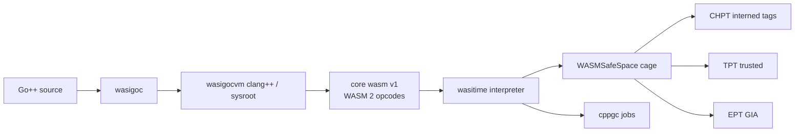

# WASM 2 hard fork

**wasigocvm’s bytecode is a hard fork of WebAssembly 2.0.** The W3C
never shipped a new binary version number for WASM 2 (the header is
still `00 61 73 6d 01 00 00 00`). The feature pack (SIMD, bulk memory,
reference types, sign-extension, non-trapping conversions, multi-value)
is what people called “WASM 2.” That pack is abandoned as a product
identity. We keep the opcodes and replace the rest of the machine.

This is the bytecode the **Go++** language (`goxx`) compiles to, and
the bytecode **wasitime** interprets. It is not Bytecode Alliance
Wasmtime, not the Component Model, not WIT, and not WASM GC.

Architecture of the process: [architecture.md](architecture.md).
Product: [wasigocvm.md](wasigocvm.md).

## What we take from WASM 2

Core integer/float, control flow, and the WASM 2 additions:

| Feature | In this fork |
| --- | --- |
| Multi-value | Block types, calls, returns |
| Sign-extension | `i32.extend8_s` … `i64.extend32_s` |
| Non-trapping float-to-int | `0xfc` 0–7 saturating trunc, plus trapping trunc |
| Bulk memory | `memory.copy` / `fill` / `init`, `data.drop` |
| Reference types | `funcref` / `externref`, `table.*`, `ref.null` / `is_null` / `func` / `eq` |
| SIMD | `0xfd` v128; values are 16-byte cage objects |
| Threads atomics | `0xfe` on cage memory; wait/notify on a waiter queue |
| Tail call | `return_call` / `return_call_indirect` |
| Exceptions | `try_table` / `throw` / `throw_ref`; old `try`/`catch` still decode |

Binary version in the module is **1**. `inspect` prints that. An outer
wrapper (if the toolchain still emits one) is discarded; only the nested
**core** module is instantiated.

## What we cut

| Cut | Why |
| --- | --- |
| Component Model | Not the ABI. Nested core is loaded; the wrapper is thrown away. |
| WIT / `wasi:cli` worlds | Guest talks **libc** in the module. |
| WASM GC (`0xfb`) | Heap is Oilpan (`cppgc`), not struct/array opcodes. |
| `--shared-memory` as the second space | One linear `Memory`. Second space is EPT / TPT / CHPT. |
| Bytecode Alliance WASI as the machine | Leftover sysroot imports on the host are traps (stdio, args, exit, clocks), not a world. |

`0xfb` traps: `gc is oilpan`.

## What we replace

WASM 2 assumed a linear memory plus (later) a GC heap of wasm structs.
This fork:

1. **Oilpan** — `GarbageCollected<T>` / `Member<T>` / `Persistent<T>`.
   Compile and interpret run as cppgc jobs (`PostJob`: blocking work
   runs on post; join is idempotent).
2. **Type intern** — every object kind and functype gets a stable id
   (same idea as `type_key` in `src/runtime.hpp`). `call_indirect`
   matches interned keys, not only a module type index.
3. **Cage + compressed pointers** — payloads live in `WASMSafeSpace/`
   `Sandbox`. A handle is `Encode(ptr) = ptr - Base` (uint32 GIA), the
   same compression as WASMv8Bindings `CompressedPointer`.
4. **Three tables** — isolation is the handle, not a second `Memory`:

| Table | Artifact | Tag | Names |
| --- | --- | --- | --- |
| **CHPT** | `WASMv8bindings/` CppHeapPointerTable | interned type id | Oilpan objects in the cage (functions, instances, v128, memory, table, globals) |
| **TPT** | `WASMSafeSpace/` TrustedPointerTable | interned type id | trusted compiled module / instance / function |
| **EPT** | `WASMSafeSpace/` ExternalPointerTable | external | memory GIA, outside resources |
| **CPT** | `WASMSafeSpace/` CodePointerTable | entrypoint | compiled function bodies in the cage |

`Get` fails unless the interned tag matches. That is type-checked
handles, not WASM GC rtt.

## Place in the Go++ (goxx) ecosystem

```
Go++ / .goxx source
        │
        ▼
wasigoc                         frontend — Go syntax → C++
        │
        ▼
compile.bat / wasigocvm.bat     -DWASIGO_GOCVM=1
        │                       our sysroot, libc++ EH/RTTI, Oilpan
        ▼
.wasigocvm.wasm                 core wasm (this fork)
        │                       libc, gocvm, cage, EPT/TPT/CHPT in-module
        ▼
wasitime                        interpreter of this fork
        inspect / run / call    examples/wazgoc + wasmbin + safespace + v8bind
```

| Name | Role in the fork |
| --- | --- |
| **Go++** | Language. `.go` handwritten; `.goxx` from WASMBruja `brujac`. |
| **wasigoc** | Compiler. Emits C++ (`int main()`), not wasm directly. |
| **wasigocvm** | Machine identity: sysroot + in-module libc + tables. |
| **wasitime** | Engine. Wasmtime-shaped CLI; Cranelift-slot is the interpreter ([wasitime.md](wasitime.md)). |
| **goclang++** | Native leftover: same frontend → `.exe` + in-process cage. |

The guest does not import a WIT world. Sockets, exec, TLS, and Win32 /
Nix / Droid names live **inside** the module. Host ABI capability is
the three catalogs: [host-abi.md](host-abi.md). wasitime only supplies
leftover traps the sysroot libc still calls for `printf` / `exit` /
args / clocks.



## How the interpreter works

Packages (Go++ subset, not a wazero vendor dump):

| Package | Port of | Job |
| --- | --- | --- |
| `examples/wasmbinpkg` | ~/WASMLoader wasmbin | Decode core sections; peel outer wrapper |
| `examples/wazgoc` | wazero-shaped API | Compile to `Op`s, instantiate, execute |
| `examples/safespacepkg` | ~/WASMSafeSpace | Cage, GIA, CPT/EPT/TPT |
| `examples/v8bindpkg` | ~/WASMv8bindings CHPT | `{ptr, tag}` handles |
| `examples/wasmloaderpkg` | ~/WASMLoader | Load / run / call / link |

**Compile.** Each function body becomes a `compiledFn` (Oilpan job).
Code bytes go in the cage; CPT `Register(code, funcidx+1)`. The function
object is interned and named on CHPT/TPT.

**Instantiate.** Linear memory, tables, and globals are cage objects
(compressed GIA). Active data/elem apply; passive stay until `*.init`.
Imported memory/table/global can alias another instantiated module’s
cage object. `invoke` checks CPT entrypoint.

**Execute.** Operand stack is `[]uint64`. v128 is a CHPT handle to 16
cage bytes. Funcref is `funcidx+1` (0 = null). `call_indirect` uses the
table in the cage and interned functype keys.

**Grow.** `memory.grow` / `table.grow` try to extend the cage allocation
in place (`GrowCage` / `GrowTail`) so existing compressed GIAs stay
valid — same property as cppgc caged-heap growth. If the bump tip
moved, the object is relocated, copied, and re-named on CHPT/TPT/EPT.

**Start.** `_start`, then `run`, then `main`, then a core export whose
name ends in `#run` if the toolchain still spelled it that way. That
string is a core export name, not a Component Model run.

## Load / run

```bash
compile.bat examples\hello\hello.go -o examples\hello\hello.wasm
wasitime inspect examples\hello\hello.wasm
wasitime run     examples\hello\hello.wasm
wasitime call    examples\wasitime\add.wasm add 2 3
```

`inspect` shows core magic `00 61 73 6d 01 00 00 00`, version 1,
sections, imports/exports, name-section function names.

`run` instantiates and calls the start export. Hello prints `hello, wasi`.

## Versus WASM 2-as-specified and versus Wasmtime

| | WASM 2 draft / Wasmtime | This fork |
| --- | --- | --- |
| Binary version | 1 | 1 |
| SIMD | v128 on the value stack | v128 in the cage, CHPT-named |
| GC | later WASM GC (`0xfb`) | Oilpan; `0xfb` rejected |
| Tables | engine array | cage `uint32` slots, compressed GIA |
| Grow | engine realloc | cage grow / relocate + re-encode GIA |
| Host ABI | WASI p1 / p2 / WIT | in-module libc; leftover traps only |
| Second space | shared memory / wasm threads | EPT / TPT / CHPT |
| Engine | Cranelift / Winch / … | Go++ interpreter on WASMLoader |

## Source map

| Path | What |
| --- | --- |
| `examples/wazgoc/` | Interpreter (compile, exec, SIMD, atomics, intern, grow) |
| `examples/wasmbinpkg/` | Core decoder |
| `examples/safespacepkg/` | Cage + tables |
| `examples/v8bindpkg/` | CHPT |
| `examples/wasitime/` | CLI |
| `src/runtime.hpp` | Guest Oilpan / type_key / goroutines |
| `src/wasigocvm_*.hpp` | In-module net / exec / libc / aspace |
